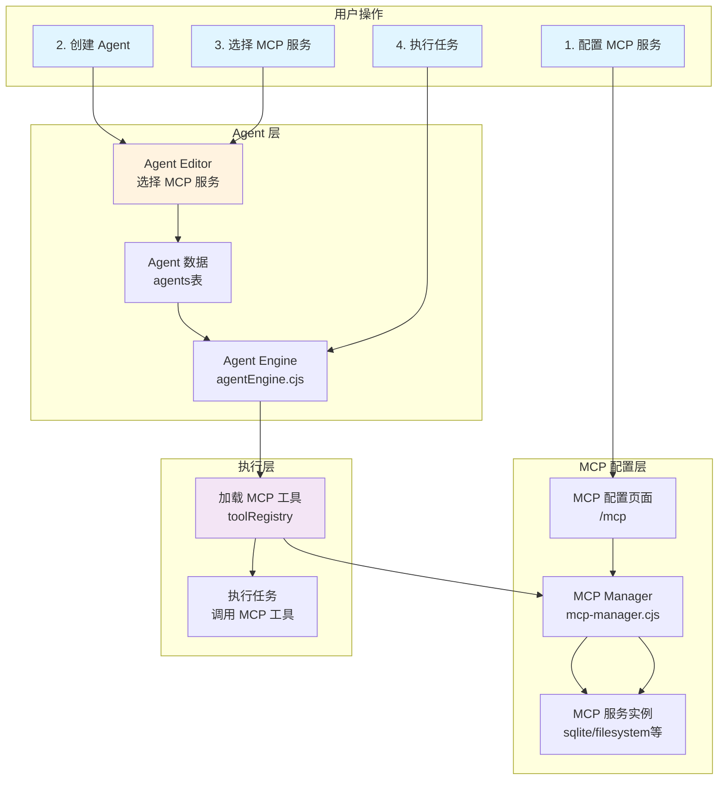

# Agent + MCP 集成实现方案

## 📊 当前状态

### ✅ 已有功能
- MCP 配置页面 (`/mcp`)
- MCP 服务管理（启用/禁用/删除）
- MCP 模板库
- MCP Manager Hook (`useMcpManager`)
- 后端 MCP Manager (`mcp-manager.cjs`)

### ❌ 缺失功能
- Agent 无法选择 MCP 服务
- Agent 表没有 `mcp_services` 字段
- Agent 执行时不加载 MCP 工具

---

## 🎯 实现目标

让用户可以：
1. 在 MCP 页面配置所需的 MCP 服务
2. 在创建 Agent 时选择已配置的 MCP 服务
3. Agent 执行任务时自动使用这些 MCP 服务的工具

---

## 📐 架构设计



---

## 🚀 实施步骤

### Step 1: 数据库扩展（5 分钟）

```sql
-- 添加 MCP 服务字段
ALTER TABLE agents ADD COLUMN mcp_services TEXT DEFAULT '[]';

-- 验证
SELECT name, mcp_services FROM agents LIMIT 5;
```

---

### Step 2: 前端 - Agent Editor 增加 MCP Tab（2-3 小时）

#### 文件：`src/components/agents/AgentEditor.jsx`

**2.1 导入 MCP Hook**

```jsx
import { useMcpManager } from '@/hooks/useMcpManager'
```

**2.2 获取可用 MCP 服务列表**

```jsx
export function AgentEditor({ agent, open, onOpenChange, onSave }) {
  // 现有的 hooks...
  const { translate } = useTranslation()
  
  // 新增：获取 MCP 服务列表
  const { services: mcpServices, loading: mcpLoading } = useMcpManager()
  
  // 过滤出已启用的服务
  const enabledMcpServices = mcpServices.filter(s => s.enabled)
  
  // ...
}
```

**2.3 更新表单 Schema**

```jsx
const agentSchema = z.object({
  name: z.string().min(1).max(100),
  description: z.string().max(500).optional(),
  type: z.enum(['conversational', 'task-based', 'analytical', 'creative']),
  capabilities: z.array(z.string()).min(1),
  mcp_services: z.array(z.string()).optional(),  // 新增
  config: z.object({
    provider: z.string().optional(),
    model: z.string().optional(),
    // ...
  }).optional(),
})
```

**2.4 添加 MCP Tab**

```jsx
<Tabs defaultValue="basic" className="w-full">
  <TabsList className="grid w-full grid-cols-4">
    <TabsTrigger value="basic">Basic</TabsTrigger>
    <TabsTrigger value="capabilities">Capabilities</TabsTrigger>
    <TabsTrigger value="mcp">MCP Services</TabsTrigger>  {/* 新增 */}
    <TabsTrigger value="advanced">Advanced</TabsTrigger>
  </TabsList>
  
  {/* 其他 Tabs... */}
  
  {/* 新增 MCP Tab */}
  <TabsContent value="mcp" className="space-y-4 mt-4">
    <FormField
      control={form.control}
      name="mcp_services"
      render={({ field }) => (
        <FormItem>
          <FormLabel>
            {translate('agents.editor.fields.mcpServices', 'MCP Services')}
          </FormLabel>
          
          {/* 启用的 MCP 服务为空提示 */}
          {enabledMcpServices.length === 0 && (
            <div className="p-4 border rounded-md bg-muted/50">
              <p className="text-sm text-muted-foreground mb-2">
                {translate('agents.editor.mcp.noServicesEnabled', 'No MCP services enabled')}
              </p>
              <Button
                type="button"
                variant="outline"
                size="sm"
                onClick={() => window.open('/mcp', '_blank')}
              >
                {translate('agents.editor.mcp.goToConfig', 'Configure MCP Services')}
                <ExternalLink className="ml-2 size-3" />
              </Button>
            </div>
          )}
          
          {/* 已选择的 MCP 服务 */}
          {field.value && field.value.length > 0 && (
            <div className="flex flex-wrap gap-2 p-3 border rounded-md min-h-[60px] mb-3">
              {field.value.map(serviceId => {
                const service = mcpServices.find(s => s.id === serviceId)
                if (!service) return null
                return (
                  <Badge key={serviceId} variant="secondary" className="gap-1">
                    {service.name}
                    <button
                      type="button"
                      onClick={() => {
                        const newServices = field.value.filter(id => id !== serviceId)
                        field.onChange(newServices)
                      }}
                      className="ml-1 hover:text-destructive"
                    >
                      <X className="size-3" />
                    </button>
                  </Badge>
                )
              })}
            </div>
          )}
          
          {/* 可选的 MCP 服务列表 */}
          <div className="space-y-2">
            <FormLabel>
              {translate('agents.editor.fields.availableMcpServices', 'Available MCP Services')}
            </FormLabel>
            <div className="grid grid-cols-2 gap-2">
              {enabledMcpServices.map(service => {
                const isSelected = field.value?.includes(service.id) || false
                return (
                  <Button
                    key={service.id}
                    type="button"
                    variant={isSelected ? 'default' : 'outline'}
                    size="sm"
                    onClick={() => {
                      const current = field.value || []
                      if (isSelected) {
                        field.onChange(current.filter(id => id !== service.id))
                      } else {
                        field.onChange([...current, service.id])
                      }
                    }}
                    className="justify-start gap-2"
                  >
                    <div className={cn(
                      "size-4 rounded-full border-2",
                      isSelected ? "bg-primary-foreground" : "bg-transparent"
                    )} />
                    <div className="flex flex-col items-start">
                      <span className="font-medium">{service.name}</span>
                      <span className="text-xs text-muted-foreground">
                        {service.description || service.id}
                      </span>
                    </div>
                  </Button>
                )
              })}
            </div>
          </div>
          
          <FormDescription>
            {translate(
              'agents.editor.mcp.hint',
              'Select MCP services to give your agent additional capabilities. Configure services in the MCP Settings page first.'
            )}
          </FormDescription>
        </FormItem>
      )}
    />
  </TabsContent>
</Tabs>
```

**2.5 更新 `onSubmit` 提交逻辑**

```jsx
const onSubmit = (data) => {
  const agentData = {
    name: data.name,
    description: data.description || '',
    systemPrompt: data.config?.systemPrompt || '',
    capabilities: normalizeCapabilityList(data.capabilities || []),
    tools: normalizeToolList(data.config?.tools || []),
    mcp_services: data.mcp_services || [],  // 新增：MCP 服务列表
    config: {
      // ...现有配置
    }
  }
  onSave?.(agentData)
}
```

**2.6 更新表单初始化**

```jsx
const form = useForm({
  resolver: zodResolver(agentSchema),
  defaultValues: {
    name: agent?.name || '',
    description: agent?.description || '',
    type: agent?.type || 'conversational',
    capabilities: normalizeCapabilityList(agent?.capabilities || []),
    mcp_services: agent?.mcp_services || [],  // 新增
    config: {
      // ...
    }
  }
})
```

---

### Step 3: 后端 - 支持 MCP 服务字段（30 分钟）

#### 文件：`server/services/agentEngine.cjs`

**3.1 `createAgent` 方法**

```javascript
async createAgent(userId, agentData) {
  const id = uuidv4();
  const {
    name,
    description = '',
    avatarUrl = '',
    systemPrompt,
    capabilities = [],
    tools = [],
    mcp_services = [],  // 新增：接收 MCP 服务列表
    config = {}
  } = agentData;

  // 验证：检查 MCP 服务是否存在
  if (mcp_services && mcp_services.length > 0) {
    const mcpManager = require('./mcp-manager.cjs');
    for (const serviceId of mcp_services) {
      // 可以添加验证逻辑
      console.log(`[AgentEngine] Agent ${name} 绑定 MCP 服务: ${serviceId}`);
    }
  }

  const agent = {
    id,
    userId,
    name,
    description,
    avatarUrl,
    systemPrompt,
    capabilities,
    tools,
    mcp_services,  // 新增
    config: {
      maxConcurrentTasks: 3,
      stopOnError: false,
      retryAttempts: 2,
      ...config
    },
    status: 'inactive',
    createdAt: new Date().toISOString(),
    updatedAt: new Date().toISOString()
  };

  await this.saveAgent(agent);
  return agent;
}
```

**3.2 `saveAgent` 方法（保存到数据库）**

```javascript
async saveAgent(agent) {
  return new Promise((resolve, reject) => {
    const { db } = require('../db/init.cjs');
    
    const columns = [];
    const values = [];
    const placeholders = [];
    
    const append = (name, value) => {
      if (hasColumn(name)) {
        columns.push(name);
        values.push(value);
        placeholders.push('?');
      }
    };
    
    append('id', agent.id);
    append('user_id', agent.userId);
    append('name', agent.name);
    append('description', agent.description || '');
    append('avatar_url', agent.avatarUrl || null);
    append('system_prompt', agent.systemPrompt || '');
    append('capabilities', JSON.stringify(agent.capabilities || []));
    append('tools', JSON.stringify(agent.tools || []));
    append('mcp_services', JSON.stringify(agent.mcp_services || []));  // 新增
    append('config', JSON.stringify(agent.config || {}));
    append('status', agent.status || 'inactive');
    append('created_at', agent.createdAt);
    append('updated_at', agent.updatedAt);
    
    // ...执行 INSERT
  });
}
```

**3.3 `formatAgent` 方法（从数据库读取）**

```javascript
formatAgent(row) {
  if (!row) return null;
  
  return {
    id: row.id,
    userId: row.user_id,
    name: row.name,
    description: row.description,
    avatarUrl: row.avatar_url,
    systemPrompt: row.system_prompt,
    capabilities: this.parseJSON(row.capabilities, []),
    tools: this.parseJSON(row.tools, []),
    mcp_services: this.parseJSON(row.mcp_services, []),  // 新增
    config: this.parseJSON(row.config, {}),
    status: row.status,
    createdAt: row.created_at,
    updatedAt: row.updated_at
  };
}
```

---

### Step 4: Agent 执行时加载 MCP 工具（1-2 小时）

#### 文件：`server/services/agentEngine.cjs`

**4.1 新增方法：加载 Agent 的 MCP 工具**

```javascript
/**
 * 为 Agent 加载绑定的 MCP 服务工具
 * @param {Object} agent - Agent 对象
 */
async loadAgentMcpTools(agent) {
  if (!agent.mcp_services || agent.mcp_services.length === 0) {
    console.log(`[AgentEngine] Agent ${agent.name} 未绑定 MCP 服务`);
    return;
  }

  console.log(`[AgentEngine] 为 Agent ${agent.name} 加载 MCP 工具...`);
  
  // 获取 MCP Manager 实例
  const MCPManager = require('./mcp-manager.cjs');
  const mcpManager = new MCPManager();
  
  // 加载每个绑定的 MCP 服务的工具
  for (const serviceId of agent.mcp_services) {
    try {
      console.log(`[AgentEngine] 加载 MCP 服务: ${serviceId}`);
      
      // 获取该服务的所有工具
      const tools = await mcpManager.listTools(serviceId);
      
      if (!tools || tools.length === 0) {
        console.warn(`[AgentEngine] MCP 服务 ${serviceId} 没有可用工具`);
        continue;
      }
      
      // 注册每个工具到 Agent 的工具库
      tools.forEach(tool => {
        const toolName = `${serviceId}.${tool.name}`;
        
        this.toolRegistry.set(toolName, {
          name: toolName,
          description: tool.description || `${serviceId} service tool`,
          source: 'mcp',
          serviceName: serviceId,
          schema: tool.inputSchema || {},
          execute: async (parameters = {}) => {
            console.log(`[AgentEngine] 调用 MCP 工具: ${toolName}`, parameters);
            
            try {
              const result = await mcpManager.callTool(
                serviceId,
                tool.name,
                parameters
              );
              return result;
            } catch (error) {
              console.error(`[AgentEngine] MCP 工具调用失败: ${toolName}`, error);
              throw error;
            }
          }
        });
        
        console.log(`[AgentEngine] ✓ 已注册 MCP 工具: ${toolName}`);
      });
      
      console.log(`[AgentEngine] ✓ MCP 服务 ${serviceId} 加载完成，共 ${tools.length} 个工具`);
      
    } catch (error) {
      console.error(`[AgentEngine] 加载 MCP 服务失败: ${serviceId}`, error);
      // 继续加载其他服务，不中断
    }
  }
  
  console.log(`[AgentEngine] Agent ${agent.name} MCP 工具加载完成`);
}
```

**4.2 在 Agent 执行前调用**

```javascript
async executeAgent(agentId, taskData, userId) {
  // 1. 获取 Agent
  const agent = await this.getAgent(agentId, userId);
  
  // 2. 加载 MCP 工具（新增）
  await this.loadAgentMcpTools(agent);
  
  // 3. 执行任务
  const task = await this.createTask(agentId, taskData, userId);
  const execution = await this.prepareExecution(agent, agentId, taskData, userId);
  
  // ...后续执行逻辑
}
```

或者在 `processTaskExecution` 开始时加载：

```javascript
async processTaskExecution(agent, task, execution, userId, options = {}) {
  try {
    // 加载 Agent 绑定的 MCP 工具（新增）
    await this.loadAgentMcpTools(agent);
    
    // 任务分解
    const subtasks = await this.taskDecomposer.decomposeTask(task, agent);
    
    // ...后续逻辑
  } catch (error) {
    // ...
  }
}
```

---

### Step 5: 测试流程（30 分钟）

**5.1 配置 MCP 服务**

1. 访问 http://localhost:5173/mcp
2. 从模板添加 `SQLite` 服务
3. 启用该服务

**5.2 创建 Agent**

1. 访问 http://localhost:5173/agents
2. 点击"创建 Agent"
3. 切换到"MCP Services" Tab
4. 选择 `SQLite` 服务
5. 保存

**5.3 验证数据库**

```sql
SELECT name, mcp_services FROM agents WHERE name = '你的Agent名称';
```

应该看到：
```
name        | mcp_services
------------|-------------
测试 Agent  | ["sqlite"]
```

**5.4 执行任务测试**

创建一个任务让 Agent 查询数据库：

```javascript
POST /api/agents/:id/execute
{
  "taskData": {
    "description": "查询 users 表中的所有用户"
  }
}
```

查看后端日志，应该看到：
```
[AgentEngine] 为 Agent 测试 Agent 加载 MCP 工具...
[AgentEngine] 加载 MCP 服务: sqlite
[AgentEngine] ✓ 已注册 MCP 工具: sqlite.query
[AgentEngine] ✓ 已注册 MCP 工具: sqlite.execute
[AgentEngine] Agent 测试 Agent MCP 工具加载完成
```

---

## 📊 数据流示意图

```
用户创建 Agent
    ↓
前端提交: { 
  name: "数据分析 Agent",
  mcp_services: ["sqlite", "filesystem"]
}
    ↓
后端保存到数据库:
agents 表 → mcp_services: '["sqlite","filesystem"]'
    ↓
用户执行任务
    ↓
Agent Engine:
  1. 读取 agent.mcp_services
  2. 遍历 ["sqlite", "filesystem"]
  3. 从 MCP Manager 获取每个服务的工具列表
  4. 注册到 toolRegistry
    ↓
任务执行:
  - Agent 可以调用 sqlite.query
  - Agent 可以调用 filesystem.read_file
  - Agent 可以调用 filesystem.write_file
```

---

## 🎯 优先级建议

### 🔥 Phase 1（今天完成）- 基础功能
1. ✅ 数据库添加 `mcp_services` 字段（5 分钟）
2. ✅ 后端支持接收和保存 MCP 服务列表（30 分钟）
3. ✅ 前端 Agent Editor 添加 MCP Tab（2 小时）

### 📅 Phase 2（明天完成）- 执行集成
4. ✅ 实现 `loadAgentMcpTools` 方法（1 小时）
5. ✅ 在 Agent 执行前调用（30 分钟）
6. ✅ 完整测试流程（30 分钟）

### 🌟 Phase 3（下周）- 优化体验
7. ✅ MCP 工具调用日志和监控
8. ✅ 错误处理和降级策略
9. ✅ MCP 服务健康检查
10. ✅ Agent 执行历史中显示 MCP 调用记录

---

## 💡 额外建议

### 1. MCP 服务预检查

在 Agent 创建时验证选择的 MCP 服务是否可用：

```javascript
// server/routes/agents.cjs
router.post('/', authMiddleware, async (req, res) => {
  const { mcp_services } = req.body;
  
  // 验证 MCP 服务
  if (mcp_services && mcp_services.length > 0) {
    const MCPManager = require('../services/mcp-manager.cjs');
    const mcpManager = new MCPManager();
    
    for (const serviceId of mcp_services) {
      const isHealthy = await mcpManager.checkServiceHealth(serviceId);
      if (!isHealthy) {
        return res.status(400).json({
          error: `MCP 服务 ${serviceId} 不可用，请先在 MCP 设置中启用`
        });
      }
    }
  }
  
  // 创建 Agent
  const agent = await agentEngine.createAgent(userId, req.body);
  res.json({ agent });
});
```

### 2. MCP 工具缓存

避免每次执行都重新加载 MCP 工具：

```javascript
class AgentEngine {
  constructor() {
    this.mcpToolsCache = new Map();  // agentId -> tools
  }
  
  async loadAgentMcpTools(agent) {
    const cacheKey = `${agent.id}_${JSON.stringify(agent.mcp_services)}`;
    
    if (this.mcpToolsCache.has(cacheKey)) {
      console.log(`[AgentEngine] 使用缓存的 MCP 工具: ${agent.name}`);
      return;
    }
    
    // 加载工具...
    
    this.mcpToolsCache.set(cacheKey, true);
  }
}
```

### 3. UI 优化：显示 MCP 工具数量

```jsx
<Badge variant="secondary">
  {service.name}
  <span className="ml-1 text-xs">({service.toolCount} tools)</span>
</Badge>
```

---

## 🐛 常见问题

### Q1: MCP 服务选择为空？
**A**: 需要先在 `/mcp` 页面启用 MCP 服务

### Q2: Agent 执行时报错"工具不存在"？
**A**: 检查 `loadAgentMcpTools` 是否被调用，查看后端日志

### Q3: MCP 工具调用失败？
**A**: 检查 MCP 服务是否正常运行：`GET /api/mcp/services`

---

## 📚 相关文档

- `/docs/features/MULTI_AGENT_WORKFLOW_GUIDE.md` - 工作流指南
- `/docs/features/AI_AGENT_WORKFLOW.md` - Agent 工作流程
- `server/services/mcp-manager.cjs` - MCP Manager 源码
- `src/hooks/useMcpManager.jsx` - MCP Hook

---

**预计总工作量**: 4-6 小时
**建议完成时间**: 2 天

---

**最后更新**: 2025-10-24
**状态**: 待实施
