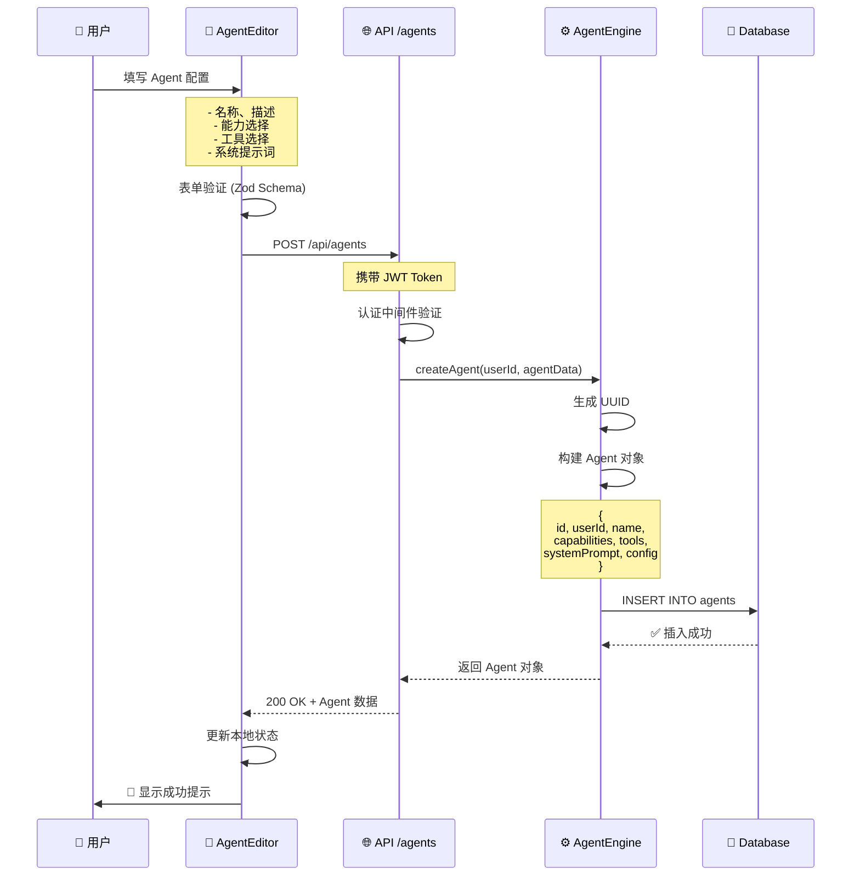
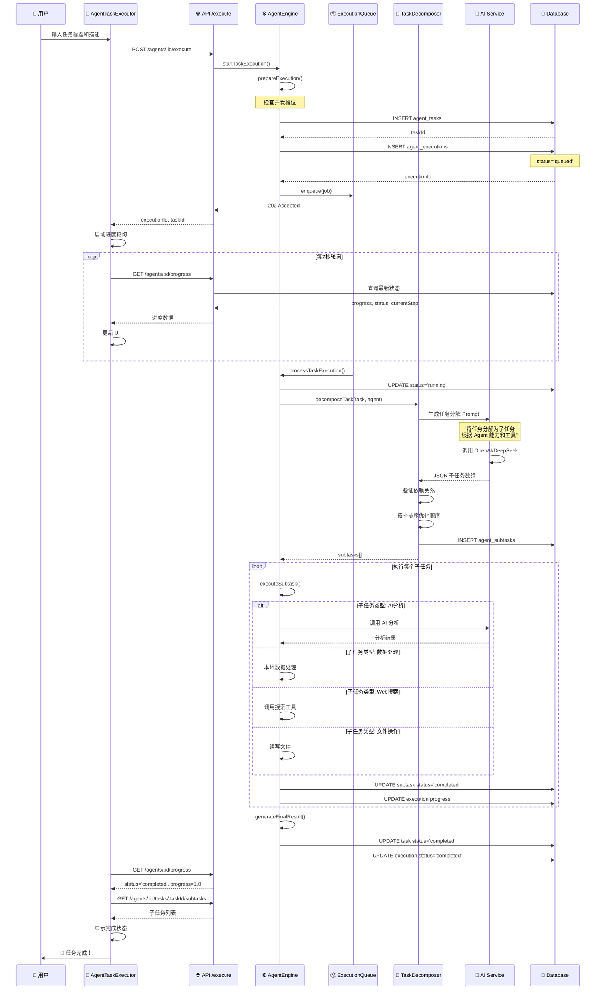
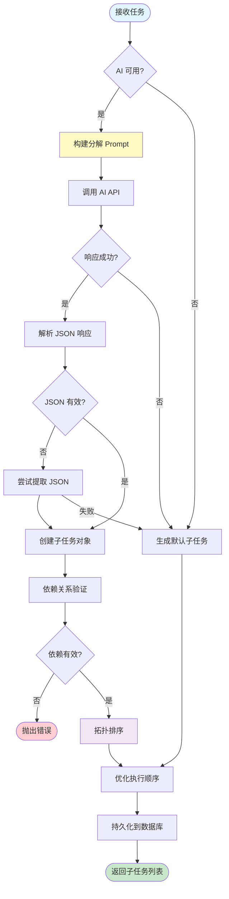
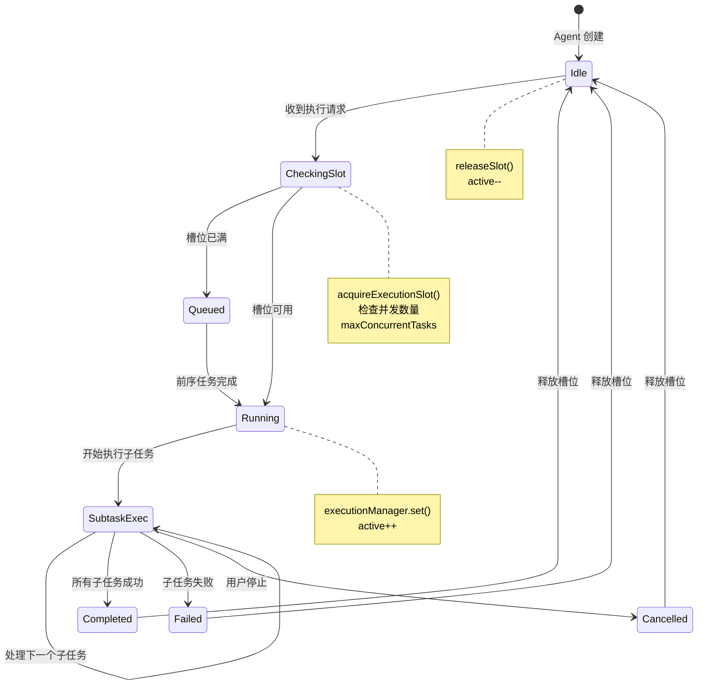
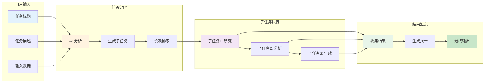
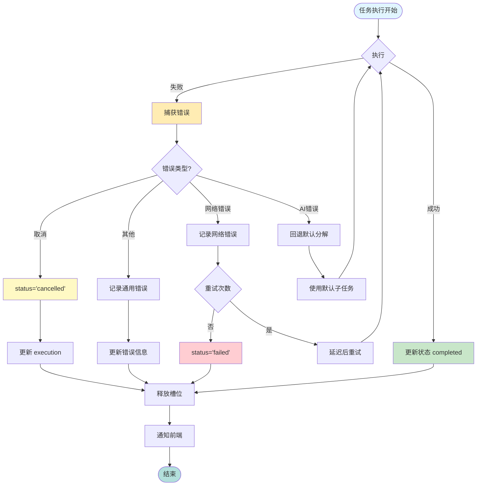

# AI Agent 工作流程详解

## 📊 整体架构流程图

```mermaid
graph TB
    subgraph "前端层 Frontend"
        A[用户界面] --> B[AgentsPage]
        B --> C[AgentList]
        B --> D[AgentEditor]
        B --> E[AgentTaskExecutor]
    end
    
    subgraph "API层 REST API"
        F[/api/agents]
        G[/api/agents/:id/execute]
        H[/api/agents/:id/progress]
    end
    
    subgraph "服务层 Services"
        I[AgentEngine]
        J[TaskDecomposer]
        K[AIService]
        L[AgentExecutionQueue]
    end
    
    subgraph "数据层 Database"
        M[(agents)]
        N[(agent_tasks)]
        O[(agent_subtasks)]
        P[(agent_executions)]
        Q[(agent_tools)]
    end
    
    subgraph "外部服务 External"
        R[OpenAI API]
        S[DeepSeek API]
    end
    
    A -->|创建/编辑 Agent| F
    A -->|执行任务| G
    A -->|查询进度| H
    
    F --> I
    G --> I
    H --> I
    
    I -->|任务分解| J
    J -->|AI分析| K
    K --> R
    K --> S
    
    I -->|队列管理| L
    I -->|数据持久化| M
    I -->|数据持久化| N
    I -->|数据持久化| O
    I -->|数据持久化| P
    I -->|工具调用| Q
    
    E -->|轮询进度| H
    
    style A fill:#e1f5ff
    style I fill:#fff4e6
    style M fill:#f3e5f5
    style R fill:#e8f5e9
```

---

## 🔄 核心流程详解

### 1️⃣ Agent 创建流程



---

### 2️⃣ 任务执行流程（核心）



---

### 3️⃣ 任务分解详细流程



---

### 4️⃣ 并发控制机制



---

### 5️⃣ 数据流转图



---

### 6️⃣ 前端组件交互图

```mermaid
graph TB
    subgraph "AgentsPage 主页面"
        A[状态管理]
        A1[agents: Agent[]]
        A2[loading: boolean]
        A3[dialogs: Object]
        
        A --> A1
        A --> A2
        A --> A3
    end
    
    subgraph "AgentList 列表组件"
        B[搜索过滤]
        B1[searchQuery]
        B2[statusFilter]
        B3[sortBy]
        
        B --> B1
        B --> B2
        B --> B3
        
        C[视图切换]
        C1[Grid View]
        C2[List View]
        
        C --> C1
        C --> C2
    end
    
    subgraph "AgentCard 卡片组件"
        D[Agent 信息]
        D1[名称/描述]
        D2[状态徽章]
        D3[能力标签]
        D4[统计数据]
        
        D --> D1
        D --> D2
        D --> D3
        D --> D4
        
        E[操作菜单]
        E1[执行]
        E2[编辑]
        E3[删除]
        
        E --> E1
        E --> E2
        E --> E3
    end
    
    subgraph "AgentEditor 编辑器"
        F[表单验证]
        F1[React Hook Form]
        F2[Zod Schema]
        
        F --> F1
        F --> F2
        
        G[配置标签页]
        G1[基本信息]
        G2[能力选择]
        G3[高级配置]
        
        G --> G1
        G --> G2
        G --> G3
    end
    
    subgraph "AgentTaskExecutor 执行器"
        H[任务控制]
        H1[开始按钮]
        H2[停止按钮]
        H3[重试按钮]
        
        H --> H1
        H --> H2
        H --> H3
        
        I[实时显示]
        I1[进度条]
        I2[子任务列表]
        I3[执行日志]
        I4[结果展示]
        
        I --> I1
        I --> I2
        I --> I3
        I --> I4
    end
    
    A --> B
    B --> D
    E1 --> I
    E2 --> G
    
    style A fill:#e1f5ff
    style B fill:#f3e5f5
    style D fill:#fff9c4
    style F fill:#e8f5e9
    style H fill:#ffecb3
    style I fill:#c8e6c9
```

---

### 7️⃣ 错误处理流程



---

## 🎯 关键技术要点

### 1. 并发控制
```javascript
// 槽位管理
acquireExecutionSlot(agent) {
  const maxConcurrent = agent.config.maxConcurrentTasks || 3;
  const entry = this.executionManager.get(agent.id) || { active: 0 };
  
  if (entry.active >= maxConcurrent) {
    throw new Error('并发上限');
  }
  
  entry.active += 1;
  return () => { entry.active -= 1; }; // 释放函数
}
```

### 2. 任务分解
```javascript
// AI 驱动的任务分解
async decomposeTask(task, agent) {
  const prompt = `
    任务: ${task.title}
    能力: ${agent.capabilities}
    工具: ${agent.tools}
    
    请生成子任务列表 JSON
  `;
  
  const response = await aiService.generateResponse(prompt);
  const subtasks = parseJsonResponse(response);
  
  // 验证依赖 + 拓扑排序
  validateDependencies(subtasks);
  return optimizeExecutionOrder(subtasks);
}
```

### 3. 进度跟踪
```javascript
// 前端轮询
useEffect(() => {
  if (status === 'running') {
    const interval = setInterval(async () => {
      const progress = await fetchProgress(executionId);
      setProgress(progress.progress);
      setCurrentStep(progress.currentStep);
      
      if (progress.status === 'completed') {
        clearInterval(interval);
        loadSubtasks();
      }
    }, 2000);
    
    return () => clearInterval(interval);
  }
}, [status]);
```

### 4. 数据持久化
```javascript
// 执行记录完整保存
await db.run(`
  INSERT INTO agent_executions (
    id, agent_id, task_id, user_id,
    status, progress, current_step,
    started_at, completed_at, duration_ms
  ) VALUES (?, ?, ?, ?, ?, ?, ?, ?, ?, ?)
`);
```

---

## 📝 使用示例

### 创建一个研究 Agent
```javascript
const researchAgent = {
  name: "Research Assistant",
  description: "帮助进行信息研究和分析",
  capabilities: ["research", "analysis", "writing"],
  tools: ["web_search", "read_file"],
  config: {
    model: "gpt-4o-mini",
    temperature: 0.3,
    maxTokens: 4000,
    systemPrompt: "你是一个专业的研究助手...",
    maxConcurrentTasks: 2
  }
};
```

### 执行任务
```javascript
const task = {
  title: "分析竞品特性",
  description: "研究市场上前3名竞品的核心功能",
  inputData: {
    competitors: ["Product A", "Product B", "Product C"]
  }
};

const result = await executeTask(agentId, task);
```

---

## 🔧 故障排查

| 问题 | 可能原因 | 解决方案 |
|------|----------|----------|
| 任务一直 queued | 并发槽位已满 | 等待或增加 maxConcurrentTasks |
| AI 分解失败 | API 密钥未配置 | 检查 .env 配置，或使用默认分解 |
| 进度不更新 | 前端轮询停止 | 检查网络连接，重新执行 |
| 子任务失败 | 工具调用错误 | 查看执行日志，检查工具配置 |

---

## 📚 相关文档
- [API 文档](./agent-implementation.md)
- [数据库设计](../../server/migrations/009-add-agent-support.sql)
- [组件文档](./agent-summary.md)

---

*最后更新: 2025-10-23*
