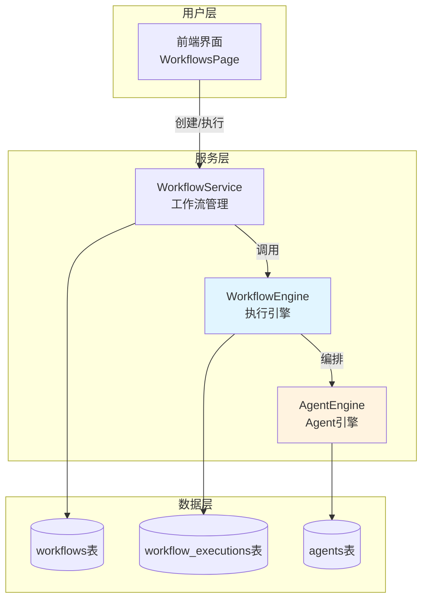

# 🔄 多 Agent 工作流组合指南

> **项目发现**: 您的 Personal Chatbox 已经内置了完整的 **Workflow（工作流）系统**！
> 
> 可以将多个 Agent 组合成复杂的自动化工作流程。

---

## 📋 目录

1. [系统架构概览](#系统架构概览)
2. [AI Agent vs Workflow 对比](#ai-agent-vs-workflow-对比)
3. [如何创建多 Agent 工作流](#如何创建多-agent-工作流)
4. [实战案例](#实战案例)
5. [数据库结构](#数据库结构)
6. [API 接口](#api-接口)
7. [前端组件](#前端组件)
8. [最佳实践](#最佳实践)

---

## 🏗️ 系统架构概览



### 核心组件

| 组件 | 文件路径 | 功能 |
|-----|---------|------|
| **WorkflowService** | `server/services/workflowService.cjs` | 工作流 CRUD、版本管理 |
| **WorkflowEngine** | `server/services/workflowEngine.cjs` | 节点执行、数据流转 |
| **AgentEngine** | `server/services/agentEngine.cjs` | Agent 任务执行 |
| **WorkflowsPage** | `src/pages/WorkflowsPage.jsx` | 工作流列表界面 |
| **WorkflowList** | `src/components/workflows/WorkflowList.jsx` | 工作流列表组件 |

---

## 🆚 AI Agent vs Workflow 对比

| 特性 | **AI Agent** | **Workflow** |
|-----|-------------|-------------|
| **定位** | 单一智能代理 | 多步骤编排系统 |
| **执行方式** | AI 驱动的任务分解 | 预定义的节点链 |
| **灵活性** | 高（AI 自主决策） | 中（固定流程） |
| **可控性** | 低（依赖 AI） | 高（明确的步骤） |
| **适用场景** | 复杂、创造性任务 | 标准化、重复性任务 |
| **能否组合** | ❌ 独立运行 | ✅ 可调用多个 Agent |

### 什么时候用 Agent？

✅ **需要 AI 智能决策的场景**
- "帮我写一篇关于 AI 的博客"
- "分析这个项目的代码质量"
- "根据用户反馈优化产品设计"

### 什么时候用 Workflow？

✅ **需要固定流程的场景**
- "每天 9 点自动生成日报并发邮件"
- "新用户注册 → 发欢迎邮件 → 创建任务 → 通知团队"
- "数据采集 → 清洗 → 分析 → 生成报告"

### 组合使用：Workflow 调用多个 Agent

✅ **最强大的场景**
- Workflow 编排整体流程
- 每个节点调用不同的 Agent
- 获得 AI 智能 + 流程可控

---

## 🎯 如何创建多 Agent 工作流

### 方法 1: 通过前端界面（推荐）

#### 步骤 1: 访问工作流页面

```
http://localhost:5173/workflows
```

#### 步骤 2: 创建新工作流

**注意**: 根据代码 (`WorkflowsPage.jsx:60-62`)，编辑器功能标记为 Phase 2.2 实现：

```javascript
const handleCreateWorkflow = () => {
  // TODO: 在Phase 2.2中实现WorkflowEditor后，这里将打开编辑器
  toast.info(translate('workflows.toasts.editorComingSoon'))
}
```

**当前状态**: 🚧 可视化编辑器正在开发中

#### 步骤 3: 目前需要通过 API 创建

---

### 方法 2: 通过 API 创建（当前可用）

#### 工作流定义结构

```javascript
{
  "name": "多 Agent 协作工作流",
  "description": "由数据分析、内容生成、报告发送三个 Agent 组成",
  "definition": {
    "nodes": [
      {
        "id": "start-1",
        "type": "start",
        "label": "开始",
        "data": {}
      },
      {
        "id": "agent-1",
        "type": "agent",
        "label": "数据分析 Agent",
        "data": {
          "agentId": "agent-uuid-1",
          "taskDescription": "分析销售数据",
          "inputMapping": {
            "data": "{{input.salesData}}"
          }
        }
      },
      {
        "id": "agent-2",
        "type": "agent",
        "label": "内容生成 Agent",
        "data": {
          "agentId": "agent-uuid-2",
          "taskDescription": "生成销售报告",
          "inputMapping": {
            "analysisResult": "{{nodes.agent-1.output}}"
          }
        }
      },
      {
        "id": "agent-3",
        "type": "agent",
        "label": "邮件发送 Agent",
        "data": {
          "agentId": "agent-uuid-3",
          "taskDescription": "发送报告邮件",
          "inputMapping": {
            "report": "{{nodes.agent-2.output}}",
            "recipients": "{{input.recipients}}"
          }
        }
      },
      {
        "id": "end-1",
        "type": "end",
        "label": "结束",
        "data": {}
      }
    ],
    "connections": [
      {
        "id": "conn-1",
        "sourceNodeId": "start-1",
        "targetNodeId": "agent-1"
      },
      {
        "id": "conn-2",
        "sourceNodeId": "agent-1",
        "targetNodeId": "agent-2"
      },
      {
        "id": "conn-3",
        "sourceNodeId": "agent-2",
        "targetNodeId": "agent-3"
      },
      {
        "id": "conn-4",
        "sourceNodeId": "agent-3",
        "targetNodeId": "end-1"
      }
    ]
  },
  "status": "published",
  "isPublic": false,
  "tags": ["销售", "自动化", "报告"]
}
```

#### API 调用示例

```bash
# 创建工作流
curl -X POST http://localhost:3001/api/workflows \
  -H "Authorization: Bearer YOUR_TOKEN" \
  -H "Content-Type: application/json" \
  -d @workflow-definition.json

# 执行工作流
curl -X POST http://localhost:3001/api/workflows/{workflow_id}/run \
  -H "Authorization: Bearer YOUR_TOKEN" \
  -H "Content-Type: application/json" \
  -d '{
    "salesData": [...],
    "recipients": ["boss@company.com"]
  }'
```

---

## 💼 实战案例

### 案例 1: 自动化内容生成管道

**场景**: 从新闻源抓取 → AI 改写 → 生成配图 → 发布到网站

```javascript
{
  "name": "内容生成管道",
  "definition": {
    "nodes": [
      {
        "id": "start",
        "type": "start"
      },
      {
        "id": "crawler-agent",
        "type": "agent",
        "label": "新闻抓取 Agent",
        "data": {
          "agentId": "crawler-agent-id",
          "taskDescription": "从 RSS 抓取今日科技新闻",
          "config": {
            "sources": ["TechCrunch", "Ars Technica"]
          }
        }
      },
      {
        "id": "writer-agent",
        "type": "agent",
        "label": "内容改写 Agent",
        "data": {
          "agentId": "writer-agent-id",
          "taskDescription": "改写新闻为原创文章",
          "inputMapping": {
            "articles": "{{nodes.crawler-agent.output}}"
          }
        }
      },
      {
        "id": "image-agent",
        "type": "agent",
        "label": "配图生成 Agent",
        "data": {
          "agentId": "image-agent-id",
          "taskDescription": "为文章生成配图",
          "inputMapping": {
            "content": "{{nodes.writer-agent.output}}"
          }
        }
      },
      {
        "id": "publisher-agent",
        "type": "agent",
        "label": "发布 Agent",
        "data": {
          "agentId": "publisher-agent-id",
          "taskDescription": "发布到 WordPress",
          "inputMapping": {
            "content": "{{nodes.writer-agent.output}}",
            "images": "{{nodes.image-agent.output}}"
          }
        }
      },
      {
        "id": "end",
        "type": "end"
      }
    ],
    "connections": [
      {"sourceNodeId": "start", "targetNodeId": "crawler-agent"},
      {"sourceNodeId": "crawler-agent", "targetNodeId": "writer-agent"},
      {"sourceNodeId": "writer-agent", "targetNodeId": "image-agent"},
      {"sourceNodeId": "image-agent", "targetNodeId": "publisher-agent"},
      {"sourceNodeId": "publisher-agent", "targetNodeId": "end"}
    ]
  }
}
```

**数据流转**:
```
RSS 源 
  → [Agent 1: 抓取] → 原始新闻列表
  → [Agent 2: 改写] → 原创文章
  → [Agent 3: 配图] → 带图文章
  → [Agent 4: 发布] → 发布成功
```

---

### 案例 2: 智能客服工作流

**场景**: 用户提问 → 意图识别 → 路由到专业 Agent → 生成回复

```javascript
{
  "name": "智能客服工作流",
  "definition": {
    "nodes": [
      {
        "id": "start",
        "type": "start"
      },
      {
        "id": "intent-agent",
        "type": "agent",
        "label": "意图识别 Agent",
        "data": {
          "agentId": "intent-classifier-id",
          "taskDescription": "分析用户问题类型",
          "config": {
            "categories": ["技术支持", "产品咨询", "投诉建议"]
          }
        }
      },
      {
        "id": "router",
        "type": "router",
        "label": "智能路由",
        "data": {
          "conditions": [
            {
              "condition": "{{nodes.intent-agent.output.category}} === '技术支持'",
              "targetNodeId": "tech-support-agent"
            },
            {
              "condition": "{{nodes.intent-agent.output.category}} === '产品咨询'",
              "targetNodeId": "sales-agent"
            },
            {
              "condition": "{{nodes.intent-agent.output.category}} === '投诉建议'",
              "targetNodeId": "complaint-agent"
            }
          ]
        }
      },
      {
        "id": "tech-support-agent",
        "type": "agent",
        "label": "技术支持 Agent",
        "data": {
          "agentId": "tech-agent-id",
          "system_prompt": "你是专业的技术支持工程师，擅长解决技术问题..."
        }
      },
      {
        "id": "sales-agent",
        "type": "agent",
        "label": "销售咨询 Agent",
        "data": {
          "agentId": "sales-agent-id",
          "system_prompt": "你是产品顾问，了解所有产品特性和定价..."
        }
      },
      {
        "id": "complaint-agent",
        "type": "agent",
        "label": "投诉处理 Agent",
        "data": {
          "agentId": "complaint-agent-id",
          "system_prompt": "你是客户关系专家，擅长处理投诉..."
        }
      },
      {
        "id": "end",
        "type": "end"
      }
    ],
    "connections": [
      {"sourceNodeId": "start", "targetNodeId": "intent-agent"},
      {"sourceNodeId": "intent-agent", "targetNodeId": "router"},
      {"sourceNodeId": "router", "targetNodeId": "tech-support-agent", "condition": "tech"},
      {"sourceNodeId": "router", "targetNodeId": "sales-agent", "condition": "sales"},
      {"sourceNodeId": "router", "targetNodeId": "complaint-agent", "condition": "complaint"},
      {"sourceNodeId": "tech-support-agent", "targetNodeId": "end"},
      {"sourceNodeId": "sales-agent", "targetNodeId": "end"},
      {"sourceNodeId": "complaint-agent", "targetNodeId": "end"}
    ]
  }
}
```

**优势**:
- ✅ 专业化：每个 Agent 专注一个领域
- ✅ 可扩展：轻松添加新类型的问题处理
- ✅ 可维护：独立优化每个 Agent 的 prompt

---

### 案例 3: 数据分析报告流水线

**场景**: 数据采集 → 清洗 → 分析 → 可视化 → 报告生成

```javascript
{
  "name": "每日数据报告",
  "definition": {
    "nodes": [
      {
        "id": "start",
        "type": "start"
      },
      {
        "id": "collector-agent",
        "type": "agent",
        "label": "数据采集 Agent",
        "data": {
          "agentId": "data-collector-id",
          "taskDescription": "从数据库和 API 采集今日数据",
          "tools": ["database_query", "api_call"]
        }
      },
      {
        "id": "cleaner-agent",
        "type": "agent",
        "label": "数据清洗 Agent",
        "data": {
          "agentId": "data-cleaner-id",
          "taskDescription": "清洗异常值和缺失值",
          "inputMapping": {
            "rawData": "{{nodes.collector-agent.output}}"
          }
        }
      },
      {
        "id": "parallel-analysis",
        "type": "parallel",
        "label": "并行分析",
        "data": {
          "branches": [
            {
              "nodeId": "trend-analyzer",
              "label": "趋势分析"
            },
            {
              "nodeId": "anomaly-detector",
              "label": "异常检测"
            },
            {
              "nodeId": "prediction-agent",
              "label": "预测建模"
            }
          ]
        }
      },
      {
        "id": "trend-analyzer",
        "type": "agent",
        "data": {
          "agentId": "trend-agent-id",
          "taskDescription": "分析数据趋势"
        }
      },
      {
        "id": "anomaly-detector",
        "type": "agent",
        "data": {
          "agentId": "anomaly-agent-id",
          "taskDescription": "检测异常模式"
        }
      },
      {
        "id": "prediction-agent",
        "type": "agent",
        "data": {
          "agentId": "prediction-agent-id",
          "taskDescription": "预测未来趋势"
        }
      },
      {
        "id": "visualizer-agent",
        "type": "agent",
        "label": "可视化 Agent",
        "data": {
          "agentId": "viz-agent-id",
          "taskDescription": "生成图表和仪表盘",
          "inputMapping": {
            "trends": "{{nodes.trend-analyzer.output}}",
            "anomalies": "{{nodes.anomaly-detector.output}}",
            "predictions": "{{nodes.prediction-agent.output}}"
          }
        }
      },
      {
        "id": "report-agent",
        "type": "agent",
        "label": "报告生成 Agent",
        "data": {
          "agentId": "report-agent-id",
          "taskDescription": "生成 PDF 报告",
          "inputMapping": {
            "visualizations": "{{nodes.visualizer-agent.output}}",
            "analysisResults": "{{nodes.parallel-analysis.output}}"
          }
        }
      },
      {
        "id": "end",
        "type": "end"
      }
    ],
    "connections": [
      {"sourceNodeId": "start", "targetNodeId": "collector-agent"},
      {"sourceNodeId": "collector-agent", "targetNodeId": "cleaner-agent"},
      {"sourceNodeId": "cleaner-agent", "targetNodeId": "parallel-analysis"},
      {"sourceNodeId": "parallel-analysis", "targetNodeId": "trend-analyzer"},
      {"sourceNodeId": "parallel-analysis", "targetNodeId": "anomaly-detector"},
      {"sourceNodeId": "parallel-analysis", "targetNodeId": "prediction-agent"},
      {"sourceNodeId": "trend-analyzer", "targetNodeId": "visualizer-agent"},
      {"sourceNodeId": "anomaly-detector", "targetNodeId": "visualizer-agent"},
      {"sourceNodeId": "prediction-agent", "targetNodeId": "visualizer-agent"},
      {"sourceNodeId": "visualizer-agent", "targetNodeId": "report-agent"},
      {"sourceNodeId": "report-agent", "targetNodeId": "end"}
    ]
  }
}
```

**特点**:
- ✅ 并行执行：3 个分析 Agent 同时运行
- ✅ 数据融合：最后合并所有分析结果
- ✅ 自动化：每天定时执行

---

## 🗄️ 数据库结构

### workflows 表

```sql
CREATE TABLE workflows (
  id TEXT PRIMARY KEY,
  user_id INTEGER NOT NULL,
  name TEXT NOT NULL,
  description TEXT,
  definition TEXT NOT NULL,          -- JSON 工作流定义
  version INTEGER DEFAULT 1,
  status TEXT DEFAULT 'draft',       -- draft, published, archived
  is_public BOOLEAN DEFAULT false,
  tags TEXT,                         -- JSON 标签数组
  created_at TIMESTAMP DEFAULT CURRENT_TIMESTAMP,
  updated_at TIMESTAMP DEFAULT CURRENT_TIMESTAMP,
  FOREIGN KEY (user_id) REFERENCES users(id) ON DELETE CASCADE
);
```

### workflow_executions 表

```sql
CREATE TABLE workflow_executions (
  id TEXT PRIMARY KEY,
  workflow_id TEXT NOT NULL,
  user_id INTEGER NOT NULL,
  status TEXT DEFAULT 'running',     -- running, completed, failed, cancelled
  input_data TEXT,                   -- JSON 输入数据
  output_data TEXT,                  -- JSON 输出数据
  error_message TEXT,
  started_at TIMESTAMP DEFAULT CURRENT_TIMESTAMP,
  completed_at TIMESTAMP,
  duration_ms INTEGER,
  FOREIGN KEY (workflow_id) REFERENCES workflows(id) ON DELETE CASCADE,
  FOREIGN KEY (user_id) REFERENCES users(id) ON DELETE CASCADE
);
```

### 与 Agent 的关联

```
workflows.definition.nodes[].data.agentId → agents.id
```

每个 `type: "agent"` 的节点通过 `agentId` 引用 `agents` 表中的 Agent。

---

## 🔌 API 接口

### 工作流管理

```javascript
// 获取工作流列表
GET /api/workflows?status=published&search=关键词&page=1&limit=20

// 获取工作流详情
GET /api/workflows/:id

// 创建工作流
POST /api/workflows
{
  "name": "工作流名称",
  "description": "描述",
  "definition": { /* 工作流定义 */ },
  "status": "published",
  "tags": ["tag1", "tag2"]
}

// 更新工作流
PUT /api/workflows/:id
{
  "name": "新名称",
  "definition": { /* 新定义 */ }
}

// 删除工作流
DELETE /api/workflows/:id
```

### 工作流执行

```javascript
// 执行工作流
POST /api/workflows/:id/run
{
  "inputKey1": "value1",
  "inputKey2": "value2"
}

// 停止工作流
POST /api/workflows/:id/stop

// 获取执行日志
GET /api/workflows/:id/logs?page=1&limit=50

// 获取执行历史
GET /api/workflows/:id/executions?status=completed&page=1&limit=20
```

### 工作流模板

```javascript
// 获取公共模板
GET /api/workflows/templates?category=automation

// 从模板创建工作流
POST /api/workflows/from-template/:templateId

// 复制工作流
POST /api/workflows/:id/duplicate

// 导入工作流
POST /api/workflows/import
{
  "workflows": [{ /* 工作流数据 */ }]
}

// 导出工作流
GET /api/workflows/:id/export
```

---

## 🎨 前端组件

### 当前状态

| 组件 | 文件 | 状态 |
|-----|------|------|
| **WorkflowsPage** | `src/pages/WorkflowsPage.jsx` | ✅ 已实现 |
| **WorkflowList** | `src/components/workflows/WorkflowList.jsx` | ✅ 已实现 |
| **WorkflowEditor** | `src/components/workflows/WorkflowEditor.jsx` | 🚧 Phase 2.2 |
| **WorkflowCanvas** | `src/components/workflows/WorkflowCanvas.jsx` | 🚧 计划中 |
| **NodeLibrary** | `src/components/workflows/NodeLibrary.jsx` | 🚧 计划中 |

### 页面功能

**WorkflowsPage** 提供：
- ✅ 工作流列表展示
- ✅ 搜索和筛选
- ✅ 执行工作流
- ✅ 删除工作流
- 🚧 创建/编辑工作流（待 Phase 2.2）

### 使用示例

```jsx
import { WorkflowList } from '@/components/workflows/WorkflowList'

function MyWorkflows() {
  const [workflows, setWorkflows] = useState([])

  return (
    <WorkflowList
      workflows={workflows}
      onExecute={handleExecute}
      onEdit={handleEdit}
      onDelete={handleDelete}
    />
  )
}
```

---

## 💡 最佳实践

### 1. 工作流设计原则

#### ✅ 单一职责
每个 Agent 只做一件事：

```javascript
// ❌ 不好：一个 Agent 做太多事
{
  "id": "super-agent",
  "taskDescription": "抓取数据、清洗、分析、生成报告"
}

// ✅ 好：拆分成多个专职 Agent
{
  "nodes": [
    {"id": "fetcher", "taskDescription": "抓取数据"},
    {"id": "cleaner", "taskDescription": "清洗数据"},
    {"id": "analyzer", "taskDescription": "分析数据"},
    {"id": "reporter", "taskDescription": "生成报告"}
  ]
}
```

#### ✅ 错误处理
每个节点设置重试和降级策略：

```javascript
{
  "id": "api-agent",
  "type": "agent",
  "data": {
    "agentId": "api-caller-id",
    "config": {
      "retryAttempts": 3,
      "retryDelay": 1000,
      "fallbackBehavior": "use_cache",
      "onError": "continue"  // 或 "stop"
    }
  }
}
```

#### ✅ 数据验证
在 Agent 之间传递数据时验证格式：

```javascript
{
  "id": "validator",
  "type": "validator",
  "data": {
    "schema": {
      "type": "object",
      "required": ["userId", "data"],
      "properties": {
        "userId": {"type": "number"},
        "data": {"type": "array"}
      }
    }
  }
}
```

---

### 2. 性能优化

#### ✅ 并行执行无依赖的 Agent

```javascript
{
  "id": "parallel-block",
  "type": "parallel",
  "branches": [
    {"nodeId": "agent-1"},  // 同时执行
    {"nodeId": "agent-2"},  // 同时执行
    {"nodeId": "agent-3"}   // 同时执行
  ]
}
```

#### ✅ 缓存中间结果

```javascript
{
  "id": "cached-agent",
  "data": {
    "cacheKey": "daily-report-{{date}}",
    "cacheTTL": 86400  // 24小时
  }
}
```

#### ✅ 控制超时

```javascript
{
  "id": "slow-agent",
  "data": {
    "timeout": 30000,  // 30秒
    "onTimeout": "use_partial_result"
  }
}
```

---

### 3. 监控和调试

#### ✅ 添加日志节点

```javascript
{
  "id": "logger",
  "type": "logger",
  "data": {
    "level": "info",
    "message": "Agent {{agentId}} completed with {{output.status}}"
  }
}
```

#### ✅ 条件断点

```javascript
{
  "id": "debugger",
  "type": "debugger",
  "data": {
    "breakOnCondition": "{{nodes.agent-1.output.error}} === true"
  }
}
```

#### ✅ 性能追踪

```javascript
{
  "id": "perf-monitor",
  "type": "monitor",
  "data": {
    "metrics": ["execution_time", "memory_usage", "api_calls"]
  }
}
```

---

### 4. 安全性

#### ✅ 权限控制

```javascript
{
  "id": "sensitive-agent",
  "data": {
    "requiredRoles": ["admin", "data_analyst"],
    "auditLog": true
  }
}
```

#### ✅ 数据脱敏

```javascript
{
  "id": "pii-handler",
  "type": "transformer",
  "data": {
    "maskFields": ["email", "phone", "ssn"]
  }
}
```

---

## 🚀 高级特性

### 1. 条件分支

```javascript
{
  "id": "condition",
  "type": "condition",
  "data": {
    "expression": "{{nodes.agent-1.output.score}} > 0.8",
    "trueNodeId": "high-priority-agent",
    "falseNodeId": "low-priority-agent"
  }
}
```

### 2. 循环执行

```javascript
{
  "id": "loop",
  "type": "loop",
  "data": {
    "items": "{{input.tasks}}",
    "iteratorNodeId": "task-processor",
    "maxIterations": 100
  }
}
```

### 3. 子工作流

```javascript
{
  "id": "sub-workflow",
  "type": "workflow",
  "data": {
    "workflowId": "child-workflow-id",
    "inputMapping": {
      "data": "{{nodes.agent-1.output}}"
    }
  }
}
```

### 4. 定时触发

```javascript
{
  "triggers": [
    {
      "type": "cron",
      "schedule": "0 9 * * *",  // 每天 9:00
      "timezone": "Asia/Shanghai"
    },
    {
      "type": "webhook",
      "url": "/api/webhooks/trigger-workflow"
    },
    {
      "type": "event",
      "eventName": "user.registered"
    }
  ]
}
```

---

## 📊 实施路线图

根据文档 `docs/AI_AGENT_OPTIMIZATION.md` 的规划：

### ✅ 阶段 1-2: 已完成
- ✅ 基础 Workflow 系统
- ✅ WorkflowService 和 WorkflowEngine
- ✅ Agent 执行引擎
- ✅ 数据库表结构
- ✅ API 路由

### 🚧 阶段 3: 进行中 (Phase 2.2)
- 🚧 可视化工作流编辑器
- 🚧 拖拽式节点编排
- 🚧 实时执行监控
- 🚧 工作流模板市场

### 📋 阶段 4-5: 计划中
- 📋 多 Agent 协作优化
- 📋 智能任务分配
- 📋 分布式执行
- 📋 工作流版本管理
- 📋 A/B 测试支持

---

## 🎓 学习资源

### 官方文档
- `/docs/AI_AGENT_OPTIMIZATION.md` - Agent 优化指南
- `/docs/features/AI_AGENT_WORKFLOW.md` - Agent 工作流程图
- `/docs/UI_ROADMAP.md` - UI 开发路线图

### 代码示例
- `/server/services/workflowEngine.cjs` - 执行引擎实现
- `/server/services/agentEngine.cjs` - Agent 引擎实现
- `/src/pages/WorkflowsPage.jsx` - 前端页面示例

### 测试文件
- `/scripts/test-agent-functionality.cjs` - Agent 功能测试
- `/test-agent-creation.cjs` - Agent 创建测试

---

## ❓ 常见问题

### Q1: Workflow 和 Agent 哪个先创建？

**A**: 先创建 Agent，再创建 Workflow。

```bash
# 步骤 1: 创建 3 个 Agent
POST /api/agents { "name": "数据采集 Agent" }
POST /api/agents { "name": "分析 Agent" }
POST /api/agents { "name": "报告 Agent" }

# 步骤 2: 创建 Workflow 引用这些 Agent
POST /api/workflows {
  "definition": {
    "nodes": [
      {"agentId": "agent-1-id"},
      {"agentId": "agent-2-id"},
      {"agentId": "agent-3-id"}
    ]
  }
}
```

---

### Q2: 如何调试工作流？

**A**: 使用执行日志和状态查询：

```javascript
// 1. 执行工作流
const execution = await axios.post(`/api/workflows/${id}/run`, input)

// 2. 轮询状态
const checkStatus = setInterval(async () => {
  const status = await axios.get(`/api/workflows/${id}/executions/${execution.id}`)
  console.log(status.data)
  
  if (['completed', 'failed'].includes(status.data.status)) {
    clearInterval(checkStatus)
  }
}, 1000)

// 3. 查看详细日志
const logs = await axios.get(`/api/workflows/${id}/logs`)
```

---

### Q3: 工作流可以嵌套吗？

**A**: 可以！使用 `type: "workflow"` 节点：

```javascript
{
  "id": "parent-workflow",
  "nodes": [
    {
      "id": "child-1",
      "type": "workflow",
      "data": {
        "workflowId": "child-workflow-id-1"
      }
    },
    {
      "id": "child-2",
      "type": "workflow",
      "data": {
        "workflowId": "child-workflow-id-2"
      }
    }
  ]
}
```

---

### Q4: 如何处理工作流中的错误？

**A**: 设置错误处理策略：

```javascript
{
  "id": "risky-agent",
  "data": {
    "onError": "continue",  // 继续执行下一个节点
    "fallbackNodeId": "error-handler-agent",  // 或跳转到错误处理节点
    "retryAttempts": 3
  }
}
```

---

### Q5: 工作流性能如何？

**A**: 根据 `AI_AGENT_CONCURRENCY_ANALYSIS.md`：

| 指标 | 当前值 | 优化后 |
|-----|--------|--------|
| 并发用户 | 2 人 | 10 人 |
| 单任务耗时 | ~30 秒 | ~15 秒 |
| 并行执行 | ❌ | ✅ |
| 任务缓存 | ❌ | ✅ |

**优化措施**:
- ✅ 已启用全局并发限制 (10)
- ✅ 已启用任务缓存
- 🚧 计划实现并行子任务执行

---

## 🎉 总结

### 核心能力

✅ **你的项目已经支持多 Agent 工作流！**

- ✅ 完整的 Workflow 系统
- ✅ 节点编排和数据流转
- ✅ Agent 调用和执行
- ✅ 执行历史和监控
- ✅ API 接口完善

### 当前限制

🚧 **可视化编辑器正在开发中 (Phase 2.2)**

目前需要通过 API 创建工作流，UI 编辑器即将推出。

### 快速开始

1. **创建 3 个 Agent** (数据采集、分析、报告)
2. **通过 API 创建 Workflow** 引用这些 Agent
3. **执行 Workflow** 观察多 Agent 协作
4. **查看执行日志** 优化流程

### 下一步

- 🚧 等待 Phase 2.2 可视化编辑器
- 📚 阅读 `/docs/AI_AGENT_OPTIMIZATION.md`
- 🧪 测试现有 Workflow 功能
- 💡 设计你的第一个多 Agent 工作流

---

**文档版本**: v1.0  
**最后更新**: 2025-10-24  
**作者**: Personal Chatbox Team
